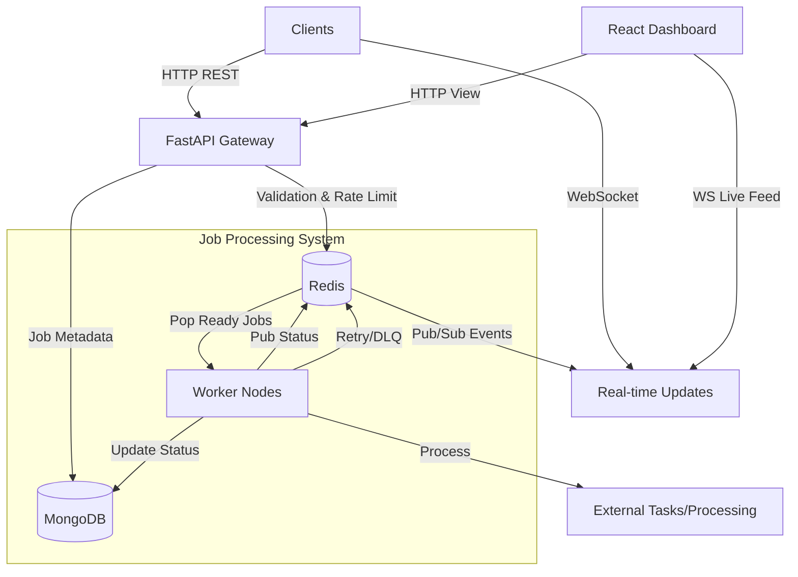

# System Architecture

## High-Level Architecture (Mermaid)



## MongoDB Schema Definitions

### Jobs Collection (`jobs`)
```json
{
  "_id": "ObjectId",
  "status": "string (queued, active, completed, failed, delayed)",
  "type": "string",
  "payload": "object (job arguments)",
  "result": "object (optional)",
  "error": "string (optional)",
  "priority": "int (1=low, 2=normal, 3=high)",
  "created_at": "datetime",
  "scheduled_at": "datetime (optional)",
  "started_at": "datetime (optional)",
  "completed_at": "datetime (optional)",
  "retry_count": "int",
  "max_retries": "int",
  "user_id": "string"
}
```

## Redis Key Design & Naming Conventions

### 1. Job Queues (Lists)
*Rationale: Reliable queueing with atomic pushes/pops.*
- `queue:immediate:high`
- `queue:immediate:normal`
- `queue:immediate:low`
- `queue:dead_letter`

### 2. Delayed Jobs (Sorted Sets)
*Rationale: Efficient retrieval of jobs by timestamp (score).*
- Key: `queue:delayed`
- Score: Unix timestamp of execution time
- Member: `job_id`

### 3. Job Processing Locks (String/SETNX)
*Rationale: Prevent double execution in distributed environment.*
- Key: `lock:job:{job_id}`
- Value: `worker_id`
- TTL: Expiry matches job timeout

### 4. Rate Limiting (Counters)
*Rationale: Fast, atomic increments with expiry.*
- Key: `ratelimit:{user_id}`
- Value: `int`
- TTL: 60 seconds (window)

### 5. Pub/Sub Channels
*Rationale: Real-time event propagation.*
- Channel: `events:jobs`
- Message: `{"job_id": "...", "status": "...", "result": "..."}`

### 6. Worker Heartbeats (Hash/Set)
*Rationale: Monitoring active workers.*
- Key: `workers:heartbeat`
- Member: `worker_id`
- Score: Timestamp
